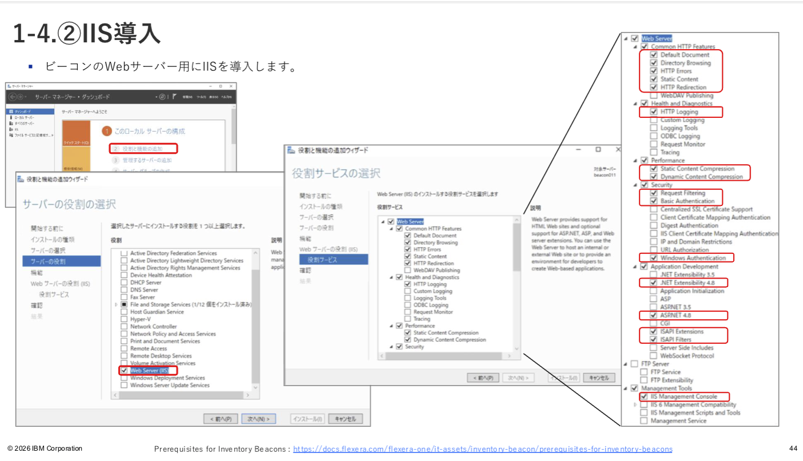

# Flexera-One---Beacon-Agent

FlexeraOne ITAM利用ガイド_v2.0.pptx をベースに TechZone に Beacon と Agent をインストールして接続してみる
https://ibm.ent.box.com/file/2175013902181

## 前提条件
- https://ibm.app.flexera.com/orgs/33975 にログインできること
- TechZone にアクセスできること


## 事前準備（Beacon用Windows）
- TechZone で Windows Server 2022 IBM Cloud VPC を予約する 
  - Geography は itz-vpc-01 - americas - us-east region - us-east-3 datacenter を選択する（多分どっちでもOK）
  - Configuration で Customizeして、Enables a public internet facing ip. を On にし、Security hardening は Off にする）
  - VM が Ready になったら、 request ページを開いて Guacamole remote desktop にアクセスできることを確認
- 上記完了後 PORT 80/443 を開けるためのサポートチケットをあげる（下記のような文面を入力すればやってくれる）https://ibmsf.my.site.com/ibminternalproducts/s/createrecord/NewCase
    ```yaml
    Please make port 80/443 accessible from the external.
     - https://techzone.ibm.com/my/requests/XXXXXXXXXXXXXXX
     - Name: XXXXXXXXXXXXXXX
     - Request ID: XXXXXXXXXXXXXXX
    ```

## 事前準備（Agent用RHEL）
- TechZone で RHEL 9 IBM Cloud VPC を予約する 
  - Geography は itz-vpc-02 - ap - jp-tok region - jp-tok-3 datacenter を選択する（多分他でもOK）
  - Configuration で Customizeして、Enables a public internet facing ip. を On にし、Security hardening は Off にする）
  - VM が Ready になったら、 ssh_private_key.pem をダウンロードして、Mac のターミナルから VM にアクセスできることを確認


## インストール（Beacon）
- Windowsにログイン
  
- Windows Remote Management Serviceの有効化
  - Windows PowerShell起動（左下メニューから）
    ```yaml
    runas /user:Administrator powershell　# Administratorパスワードの入力
    Enable-PSRemoting -Force
    ```
    
- IISインストール（参考 https://qiita.com/carol0226/items/4357e773efdbb08b5c52 ）
  - Server Manager起動
    ```yaml
    runas /user:Administrator powershell
    Start-Process ServerManager.exe runAs
    ```
  - IIS設定
    - 基本はデフォルトでOKだが、下記は注意
    -  

- ファイアウォールの無効化（ほんとは PORT 80/443 だけでいいかも）
  - Server Manager起動
    ```yaml
    runas /user:Administrator powershell
    Set-NetFirewallProfile -Profile Domain,Private,Public -Enabled False
    ```

- Flexera Oneにログイン（ https://ibm.app.flexera.com/orgs/33975 ）

- Beacon ダウンロード（ FlexeraOne ITAM利用ガイド_v2.0.pptx の P45 ）

- Beacon Installer起動
    ```yaml
    runas /user:Administrator powershell
    Start-Process C:\Users\itzuser\Downloads\BeaconInstaller25.5.0.9
    ```

- Beacon インストール（ FlexeraOne ITAM利用ガイド_v2.0.pptx の P46,47 ）

- Beacon 起動
    ```yaml
    runas /user:Administrator powershell
    Start-Process "C:\Program Files\Flexera Software\Inventory Beacon\DotNet\bin\InventoryBeacon.exe"
    ```

- ビーコンの構成（ FlexeraOne ITAM利用ガイド_v2.0.pptx の P49,50 ）
  - メニュー「Data Collection/IT Assets インベントリ タスク/ビーコン」
 


  
## インストール（Agent用RHEL）
- public ip address 取得

- ssh_private_key.pem ダウンロード

- Flexera Oneにログイン（ https://ibm.app.flexera.com/orgs/33975 ）

- Agent ダウンロード（ FlexeraOne ITAM利用ガイド_v2.0.pptx の P54 ）
  - メニュー「Data Collection/インベントリの設定」

ここからターミナル（Mac）、Teramterm（Windows）を操作
- pemのパーミッション変更
  ```yaml
  chmod 400 ssh_private_key.pem
  ```

- Agent アップロード
  ```yaml
  scp -P 2223 -i ssh_private_key.pem managesoft-25.5.0-1.x86_64.rpm itzuser@<public ip>:/home/itzuser
  ```

- RHEL にログイン
  ```yaml
  ssh -p 2223 -i ssh_private_key.pem itzuser@<public ip>
  ```

- BeaconのIPに疎通確認（curl だけでOK）
  ```yaml
　curl http://<Beacon の public ip>
  ssh -p 80 <Beacon の public ip>
  ping <Beacon の public ip>
  ```

- Beaconのホスト名設定
  ```yaml
  sudo vi /etc/hosts
　<Beacon の public ip>   <Beacon の ホスト名>
  ```

- Beaconのホストに疎通確認（curl だけでOK）
  ```yaml
　curl http://<Beacon の ホスト名>
  ```

- Agent インストールブートストラップファイル作成（ FlexeraOne ITAM利用ガイド_v2.0.pptx の P55 ）
  - https://docs.flexera.com/fnms/EN/GatherFNInv/index.html#SysRef/FlexNetInventoryAgent/topics/FA3-SampleBootstrap.html のサンプルをコピーして、下記を編集
  ```yaml
  MGSFT_BOOTSTRAP_DOWNLOAD=http://<Beacon の ホスト名>/ManageSoftDL/
  MGSFT_BOOTSTRAP_UPLOAD=http://<Beacon の ホスト名>/ManageSoftRL/
  ```
  - 上記をコピーして mgsft_rollout_response を作成
  ```yaml
　vi /var/tmp/mgsft_rollout_response
  ```

- Agent インストール（ FlexeraOne ITAM利用ガイド_v2.0.pptx の P56 ）
  ```yaml
  sudo rpm --upgrade --oldpackage --verbose managesoft-25.5.0-1.x86_64.rpm
  ```

- Agent 確認（ FlexeraOne ITAM利用ガイド_v2.0.pptx の P57 ）
  ```yaml
  rpm --query managesoft
  sudo head /var/opt/managesoft/etc/config.ini
  ```

- 手動インベントリ収集(Linux)（ FlexeraOne ITAM利用ガイド_v2.0.pptx の P58 ）
  ```yaml
  sudo head /var/opt/managesoft/scheduler/schedules/sched.nds
  cd /opt/managesoft/bin/
  sudo ./ndschedag -x "<上記のID>"
  ```

- 手動インポート・照合（ FlexeraOne ITAM利用ガイド_v2.0.pptx の P64 ）
  - メニュー「Data Collection/照合」

- Agent確認（ FlexeraOne ITAM利用ガイド_v2.0.pptx の P65 ）
  - メニュー「Inventory/Inventory/FlexNet Inventory Agent Status」（Device nameはホスト名）

